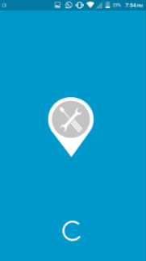
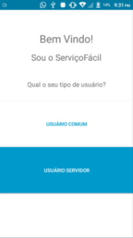
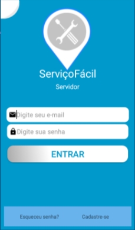
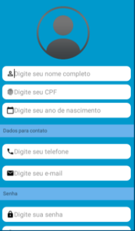
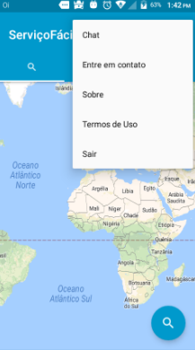

# ServicoFacil

Aplicação Android desenvolvido durante o projeto de faculdade para fins de estudo
O foco deste aplicativo era facilitar o ganho de dinheiro para prestadores de serviços como pedreiros, encanadores, pintores, entre outros. E facilitar o acesso do usuário a estes profissionais.

O aplicativo está dois em um, mas isso foi apenas para a demonstração de como funcionária.

### Tecnologias utilizadas
 - Java como linguagem de programação
 - SQLite como banco de dados
        Foi alterado para SQLite para podermos realizar a apresentação em sala de aula, poderia haver algum problema de conexao com a internet se utilizassemos o           firebase
        
 - Também foi utilizado o padrão de arquivos MVC onde é organizado com Model, View e Controller

### A splash da aplicação

### A home onde é possível entrar como usuário ou profissional

### A login onde é realizado a autenticação do usuário usando o firebase

### A register onde é realizado o cadastro de usuários e vai depender se ele é usuário comum ou profissional

### A map que é a tela onde mostra os profissionais disponíveis e sua localização

